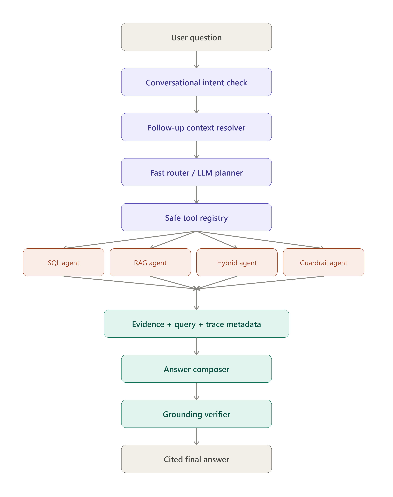

# PharmaRev AI

[Live Demo](https://pharma-rev-ai.vercel.app/)

PharmaRev AI is a public pharma intelligence chat app that answers questions across Medicare Part D spending, prescriber costs, Open Payments, public sales trends, and FDA label evidence. It routes each question to the right data path, runs safe SQL/RAG tools, cites the supporting evidence, and explains the process behind each answer.

---

## Tech Stack


---

## What It Does

PharmaRev AI answers natural-language questions about loaded public pharma datasets by choosing the correct route:

- **SQL** for exact numbers and rankings
- **RAG** for FDA label and document evidence
- **Hybrid SQL + RAG** for questions that need both data and explanation
- **Guardrail/refusal** path for private or unsupported claims

Citations, query details, and a process trace are shown so users can inspect how each answer was produced.

---

## Interacting with Sources, Queries, and Visuals

Every answer is meant to be inspected, not just read. The UI exposes the working behind each response:

**Citations and evidence**
Claims pulled from FDA labels or document chunks are linked inline to their source. Click a citation and it opens the underlying evidence snippet, the exact passage the answer drew from, along with the document it came from. That way a claim can be checked against its origin instead of taken on faith.

**Query drawer**
For SQL-backed answers, the generated query itself is available to expand and read. This shows exactly which tables, filters, and aggregations produced the numbers in the answer, instead of treating the SQL agent like a black box.

**Process/trace drawer**
Each answer carries a trace of how it was handled: which route the router picked, which tools from the safe tool registry got called, and how the grounding verifier judged the result (supported, limited, or refused). It's the same flow shown in the architecture diagram above, just surfaced per answer.

**Charts and rankings**
Spending, prescriber cost, and sales-trend questions that return ranked or time-series data get rendered as charts and tables next to the written answer, not just as raw numbers in prose. Useful for things like "highest Medicare Part D spending" or "spending trend for Keytruda."

**Follow-ups**
Since the context resolver tracks the previous question, a follow-up like "what about Humira?" gets resolved against that prior intent instead of needing to be fully re-specified.

---

## Example Questions

**Medicare Part D Spending**
- Which drugs had the highest Medicare Part D spending in 2024?
- What is the spending picture for Eliquis?

**Prescriber Cost Analysis**
- For Humira, where were prescriber costs highest?
- Where were Eliquis prescriber costs concentrated?

**FDA Label Evidence**
- What is Eliquis used for according to the FDA label?
- Summarize the FDA label context for Ozempic.

**Hybrid SQL + RAG**
- For Keytruda, show spending trend and FDA warnings.
- Compare Eliquis spending with its FDA label indication.

**Open Payments**
- Show Open Payments records related to Eliquis.
- Which companies appear most often in Open Payments data?

**Public Sales Trends**
- Show public pharma sales trend data by category.

**Unsupported / Private Data (Guardrails)**
- Which sales rep lost the most private pharma deals?
- What was the rebate-adjusted net revenue for this drug?

None of that is in the loaded public datasets, so the assistant explains the limitation instead of hallucinating.

---

## Loaded Public Data

Configured as a 2024 public-data demo.

| Dataset                     |   Rows |
| --------------------------- | -----: |
| Medicare Part D Spending    | 14,536 |
| Medicare Part D Prescribers | 14,274 |
| Open Payments               | 84,889 |
| Public Pharma Sales         | 16,848 |
| FDA Label Documents         |  1,247 |
| FDA Label Evidence Chunks   |  6,058 |

Row counts and previews are read live from Neon/Postgres, so the data coverage page updates as the database changes.

---

## Architecture



**Router**: classifies each question into SQL-only, RAG-only, hybrid, ambiguous, unsupported, or unrelated.
**Context Resolver**: handles follow-ups like "what about Humira?"
**Safe Tool Registry**: only allows registered public-data tools to run.
**SQL Agents**: answer exact numeric questions from structured tables.
**RAG Retrieval**: retrieves FDA label and public evidence chunks via local embeddings.
**Answer Composer**: improves wording while preserving citations and evidence boundaries.
**Grounding Verifier**: checks whether the answer is supported, limited, or should be refused.
**Answer Flow UI**: shows how the question moved through router, tools, evidence, composer, verifier, and final answer.

---

## Evaluation Results

Evaluated on 1,000 questions across SQL, RAG, hybrid, ambiguous, private-unanswerable, and unrelated-firewall categories.

| Metric                   |    Result |
| ------------------------ | --------: |
| Overall Pass Rate        |     88.3% |
| Tool Accuracy            |     94.5% |
| Route Accuracy           |     95.8% |
| Citation Support         |     96.3% |
| SQL Success              |       97% |
| Private Refusal Accuracy |      100% |
| Evidence Recall@5        |       95% |
| Avg Latency              | 174.86 ms |
| P95 Latency              |    408 ms |

**By Category:** SQL Only 72%, RAG Only 92%, Hybrid 92.5%, Private Unanswerable 100%, Ambiguous 80%, Unrelated Firewall 100%

---

## Optimizations

- Compact Neon storage strategy for public-data demo deployment
- Dynamic data coverage page with live table counts and previews
- 2024-only CMS Part D mode to stay within storage limits
- Router-first architecture to avoid unnecessary LLM calls
- Deterministic SQL answers for numeric claims
- Public-data guardrails for private revenue, rebate, CRM, and sales-rep questions
- Evidence, query, and process drawers with answer-flow visualization

---

## Limitations

PharmaRev AI only answers from loaded public datasets. It can't infer private revenue, rebates, contract terms, CRM opportunities, sales-rep performance, internal margins, or year-over-year trends beyond 2024. When a question needs data that isn't available, the assistant just says so.

---

## Local Development

```bash
npm install
npm run dev      # start dev server
npm run build    # production build
npm run start    # run production build locally
```

Environment variables are configured in `.env.local` locally and in Vercel Project Settings for deployment.

---

## Deployment

Deployed on Vercel: [https://pharma-rev-ai.vercel.app/](https://pharma-rev-ai.vercel.app/)

Runtime data is served from Neon/Postgres. Local ingestion, evaluation, and maintenance scripts are excluded from deployment.